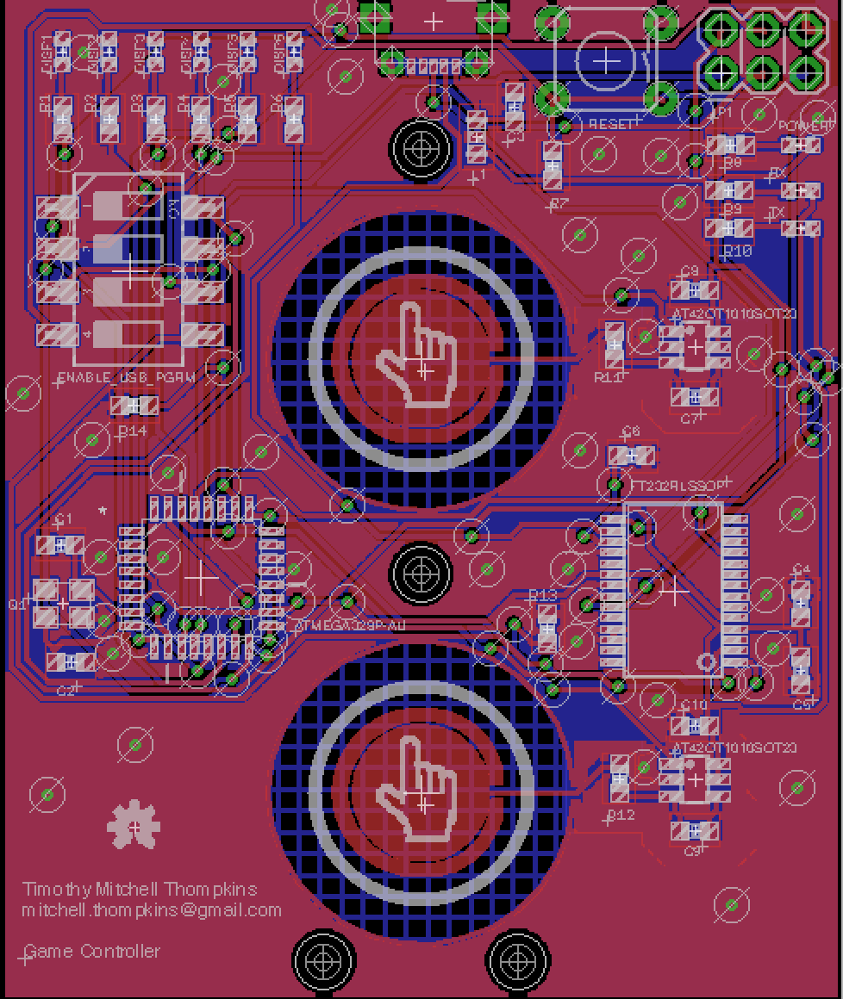
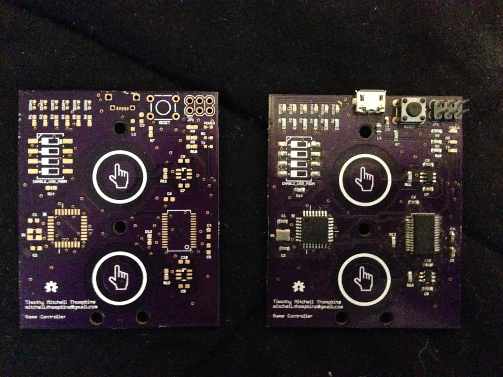
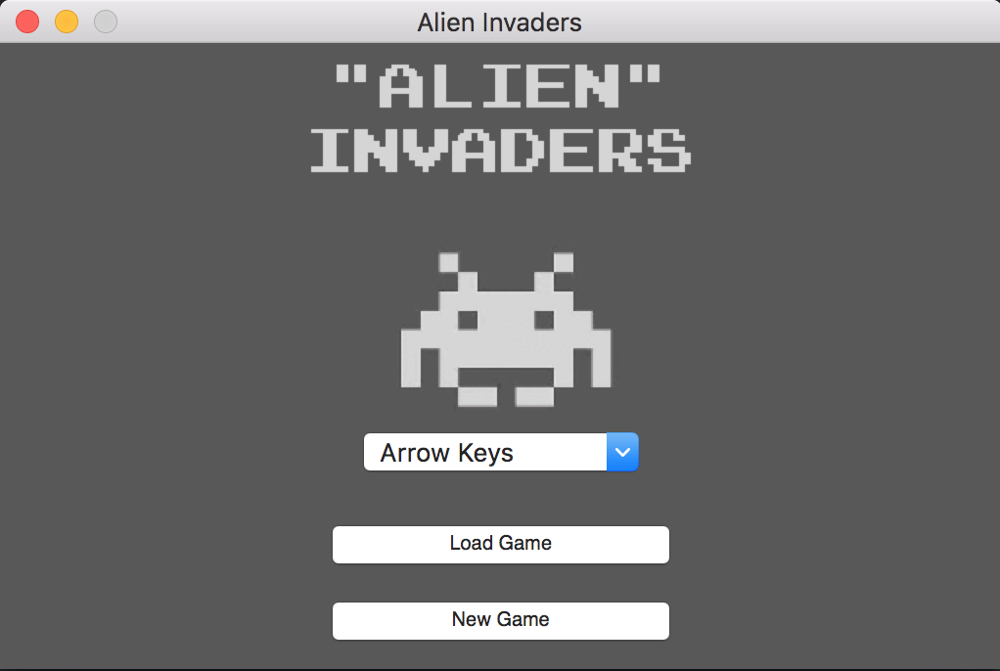

This is a work in progress, but ultimately aspires to a space invaders-esque game which is played completely on an embedded touch controller and interfaced with a display device such as a computer, or Rasbery Pi.

This is the current revision of the PCB:

This is the current revision both unpopulated (left) and populated (right):

This is the loading screen for the game, developed in python:

